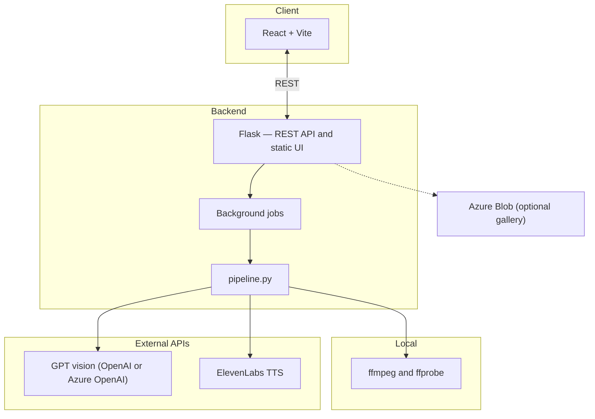

# Attenborofy

A web application that adds video narration in the style of Sir David Attenborough.

## Architecture



In development, the Vite dev server proxies `/api` to Flask; in production, Flask serves the built SPA from `frontend/dist` and handles API routes. The processing pipeline extracts frames, calls the vision model for narration text, synthesizes speech, then muxes audio and burns subtitles with ffmpeg. The gallery integration is optional (see below).

## Quickstart

### Prerequisites

- [Node.js](https://nodejs.org/) 20+
- [Python](https://www.python.org/) 3.12+
- [uv](https://docs.astral.sh/uv/) (Python package manager)
- [ffmpeg](https://ffmpeg.org/) (video processing)
- An [ElevenLabs](https://elevenlabs.io/) API key
- An [OpenAI](https://platform.openai.com/) API key (or Azure OpenAI endpoint)

### Setup

```bash
# Clone and enter the repo
git clone <repo-url> && cd attenborofy

# Copy the example env file and fill in your API keys
cp .env.example .env

# Install backend dependencies
cd backend && uv sync && cd ..

# Install frontend dependencies
cd frontend && npm install && cd ..
```

### Run (production-style)

Build the frontend, then start Flask; it serves the built UI from `frontend/dist`.

```bash
cd frontend && npm run build && cd ..
cd backend && uv run python app.py
```

Open [http://localhost:5001](http://localhost:5001) in your browser.

### Development

For hot reload on the UI, run the backend and Vite together (Vite proxies `/api` to port 5001):

```bash
# Terminal 1 — from repo root
cd backend && uv run python app.py

# Terminal 2
cd frontend && npm run dev
```

Use the URL Vite prints (typically [http://localhost:5173](http://localhost:5173)).

### Tests

```bash
cd backend && uv run pytest
```

## How It Works

1. **Upload** — you upload a short video (10–30 seconds)
2. **Extract frames** — the backend pulls evenly-spaced frames from the video
3. **Generate narration** — frames are sent to a GPT vision model which writes a David Attenborough-style narration
4. **Text-to-speech** — the narration is converted to audio via ElevenLabs
5. **Compose** — the original audio is mixed with the narration and subtitles are burned in, producing the final video

## Voice Configuration

The app ships with a paid ElevenLabs voice clone in `backend/config.json` that closely resembles Sir David Attenborough. **FREE users won't have access to this voice.**

`.env.example` documents an optional `ELEVENLABS_VOICE_ID` for "George" (`JBFqnCBsd6RMkjVDRZzb`), a free built-in British male voice — uncomment that line in your `.env` to use it. When set, it overrides the voice in `config.json`.

To use a different voice, replace the `ELEVENLABS_VOICE_ID` value in your `.env` with any ElevenLabs voice ID.

## Optional: community gallery

Uncomment and set `AZURE_STORAGE_CONNECTION_STRING` and `AZURE_STORAGE_CONTAINER` in `.env` to enable uploading finished videos to a gallery (see `gallery_store.py`).

## Project Structure

```
backend/
  app.py            # Flask API + static serving of frontend/dist
  pipeline.py       # Video processing (frames → narration → TTS → compose)
  app_config.py     # Loads config.json
  config.json       # Voice ID, TTS tuning, video duration limits
  required_env.py   # Validates .env against .env.example
  jobs.py           # Background job management
  gallery_store.py  # Optional Azure Blob gallery
frontend/
  src/              # React + TypeScript (Vite)
```
